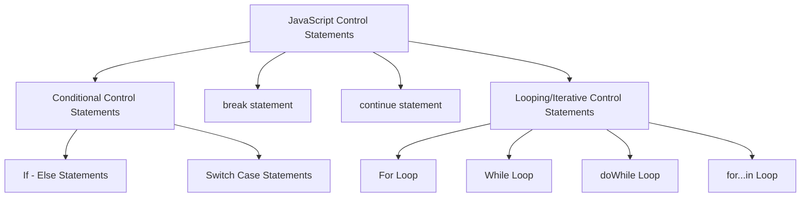

# Control Flow

| if                   |  if , else              | if / else if / else                  | switch                  |
|----------------------|-------------------------|--------------------------------------|-------------------------|
|                      |                         |                                      |                         |
| if ( true ) {        |  if ( false ) {         |    if(false){                        |    switch(key){         |
|    execute code      |     not execute code    |         not execute code             |        case value:      |
| }                    |  } else {               |    } else if ( true ) {              |              code       |
|                      |       execute this      |          execute code                |              break;     |
|                      | }                       |    } else {                          |                         |
|                      |                         |         if(false),else if(false),    |       default:          |
|                      |                         |           execute code               |             code        |
|                      |                         |    }                                 |             break;      |
|                      |                         |                                      |     }                   |

