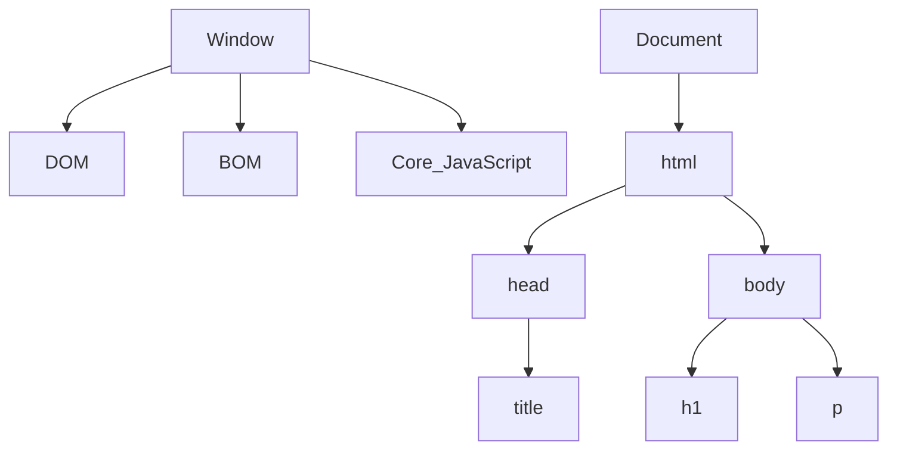
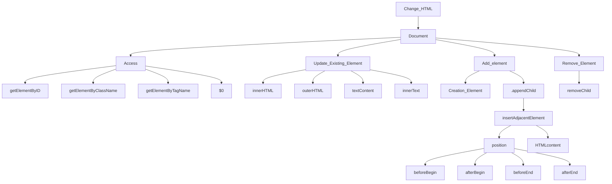

# JS DOM Manipulation 

# # What is DOM ?

- **Manipulating HTML through JavaScript code**

- The **Document Object Model (DOM)** in JavaScript is a programming interface that allows scripts to dynamically access and manipulate the content, structure, and style of HTML documents. 

- It represents the document as a tree of objects, where each node corresponds to a part of the document (such as elements, attributes, and text).

- **Window Obj ---> global Obj** &nbsp;  &nbsp;    (sab kuch window object ke ander ata hain sab isi ke child hain)

- **HTML code ---> Convert JavaScript Object  ---> Document**

- **HTML Tag  ---> Convert token ---> Convert node ---> Bunch of node is DOM**

## DOM Tree Structure



## DOM MANIPULATION  

**The HTML DOM Tree of Objects**


# # How to Manipulate HTML through JavaScript code ?

## 1. Access Element

- We access elements by different methods.
  - **By Id** ---> `documnet.getElementById("#myid")`
  - **By Class** ---> `document.getElementByClassName("myClass")` &nbsp; &nbsp; &nbsp; // return HTML collection
  - **By Tag Nmae** ---> `document.getElementByTagName("p")`
  - **By Id** ---> `document.querySelector(".myclass")`
  - **By Id** ---> `document.querySelectorAll(".myclass")` &nbsp; &nbsp; &nbsp; // return node list 

>[!NOTE]
> **Node list and HTML collection are not pure array (array like)**

## 2. Update Element

i. **innerHTML**

-  It returns all text, including html tags, that is contained by an element.
-  It will show the value and apply any HTML formatting

``` js
<p id="para">
 Hi my name is Abhishek Yadav.
 <span>I am 21 years old.</span> I like Programming , Chess , Cricket.
</p>

let para  = documnet.querySelector("#para")
para.innerHTML = "I am from Delhi"                   // I am from Delhi
```
> [!NOTE]
> **Console**  
> 'Hi my name is Abhishek Yadav.\n\t\t\t<span>I am 21 years old.</span> I like Programming , Chess , Cricket.\n\t\t'

i. **innerText**

- It returns all text contained by an element and all its child elements.
- It will show the value as is and ignores any HTML formatting which may be included.

``` js
<p id="para">
 Hi my name is Abhishek Yadav.
 <span>I am 21 years old.</span> I like Programming , Chess , Cricket.
</p>

let para  = documnet.querySelector("#para")
para.innerTextL = "I am from Delhi"                   // I am from Delhi
```

> [!NOTE]
> **Console**
> 'Hi my name is Abhishek Yadav. I am 21 years old. I like Programming , Chess , Cricket.'


